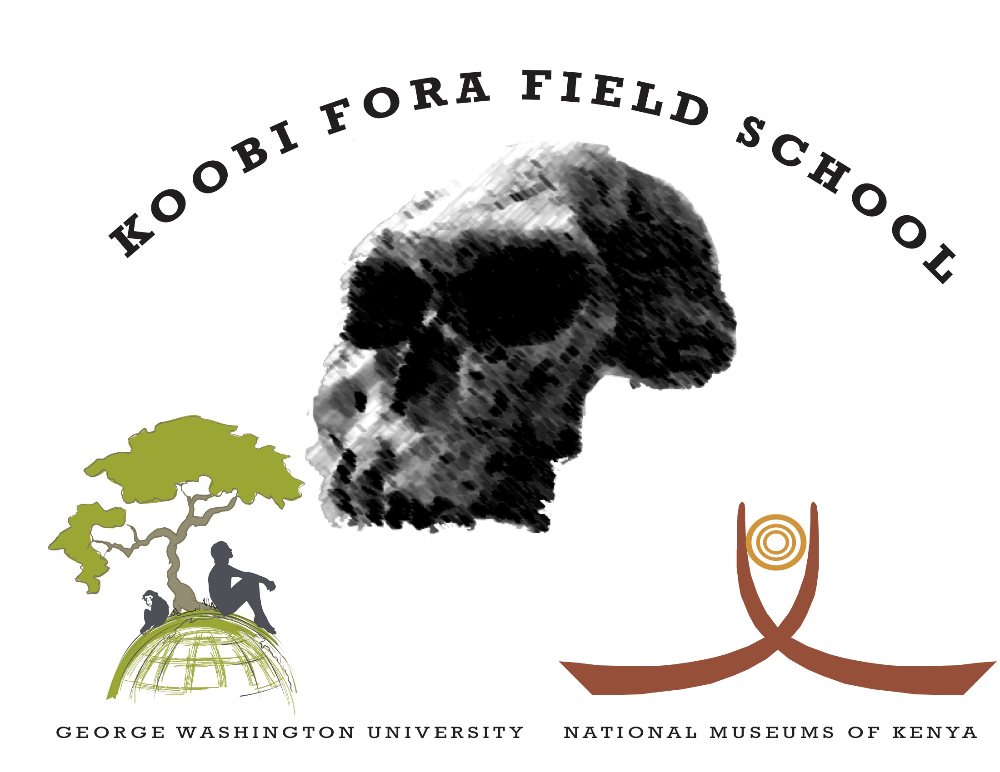

The [National Museums of Kenya](http://www.museums.or.ke/) and George Washington University’s Center for the Advanced Study of Human Paleobiology have teamed up to provide you with a unique opportunity to explore some of the most remote parts of Africa and search for evidence of hominins in the most dramatic landscapes you will ever experience.

