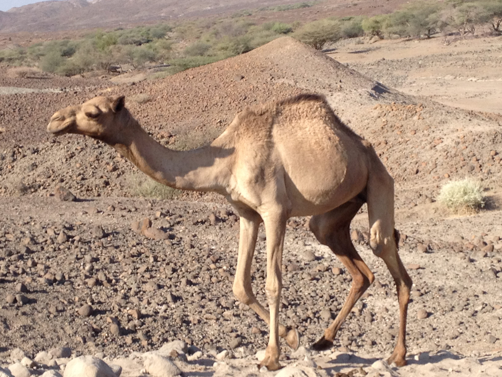

The **basecamp** will be set on the eastern shore of Lake Turkana, which is one of the world’s largest saline lakes (˜800 km northeast of Nairobi, an approximately 2 day drive). Nairobi is located in the [Sibiloi National Park](http://www.kws.go.ke/content/sibiloi-national-park) a [WORLD HERITAGE SITE](http://whc.unesco.org/en/list/801) famous for its natural and cultural history. The area’s continuing tectonic activity makes the region an epicenter of research in environments, climate, tectonics, human evolution and wildlife ecology. The Koobi Fora region is located about 3° North of the Equator (N 3°56’ and E 36°11’) with an altitude of ca. 398 m. The temperatures can range from 65°F to 115°F. Therefore, days are usually very hot and dry but nights and mornings can be cool. Students are advised to bring light cotton shorts and shirts or blouses, brimmed hats and sunglasses for the days and long, light pants and fleece jackets for the evenings and mornings.

The **field terrain** varies from flat scrublands to steep, rocky outcrops. Field instructions will include hiking down and up the slippery outcrops and we recommend rugged boots with deep treads for a good grip and to protect against the acacia tree thorns. Occasional long distance walks (approximately 30 minutes) will be involved depending on the accessibility of particular study sites. Dust is prevalent so precautions should be taken such as using bandanas and students using contacts should use their glasses during the field school.

**Meals** are be prepared by experienced cooks. Meals consist of bread, sandwiches, pasta, rice, potatoes, chapati (naan), ugali (corn meal), githeri (mix of corn, red beans, vegetables– served hot) and cooked vegetables and goat meat, etc. Fresh vegetables include peas, carrots, onions, and cabbage. Fresh vegetables, goat and chicken are purchased from Ileret town occasionally. However, since the area is so remote, fresh food is not always available. Breakfast consists of fresh brewed coffee, tea, eggs, fresh bread (made daily by the cooks in a firewood stove), oatmeal, cereal, and porridge made from corn, millet and sorghum flour.

**Water** is collected from freshly dug wells in the Ileret region so water is used carefully and, sometimes sparingly. Drinking water is treated and filtered by the kitchen and field school staff.

**Accommodation** is in tents pitched in a well-planned arrangement inside the camp boundaries. Each student should bring his or her own small wind- and moisture-resistant tent, sleeping bag, or bedding supplies and towels. Temperature controlled showers are not available, but showers are available at base camp and students will be transported to bathe at the lake during their time at Ileret camp. Bathing in Lake Turkana is completely safe, the activity of local people has cleared the waters of hippos and crocodiles. It is advisable to bring sandals for the bathing. The toilets are pit latrines fitted with toilet seat covers, which we maintain regularly. Due to water scarcity, laundry can be hand washed by the students at the lake at both Ileret camp and Koobi For a base camp. Students should bring their own string to set up a laundry line for themselves.

**Miscellaneous**

Solar and kerosene lamps and candles are commonly used in the dining hall and in the field labs for light. Power is very limited so bring a couple of flashlights or headlamps (with batteries). There is solar powered electricity (110V and 220V outlets available) but its use is restricted to our research lab. We also use a small generator (220V only) to charge batteries, computers etc. (turned on for a couple of hours per day). There is a cellphone network at the Ileret Camp and, although not always available, provided by Safaricom. Contact information will be provided for receiving calls and limited access to call home as a satellite phone is available for emergency use at all times.